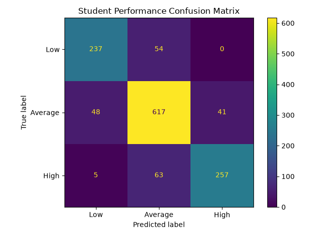
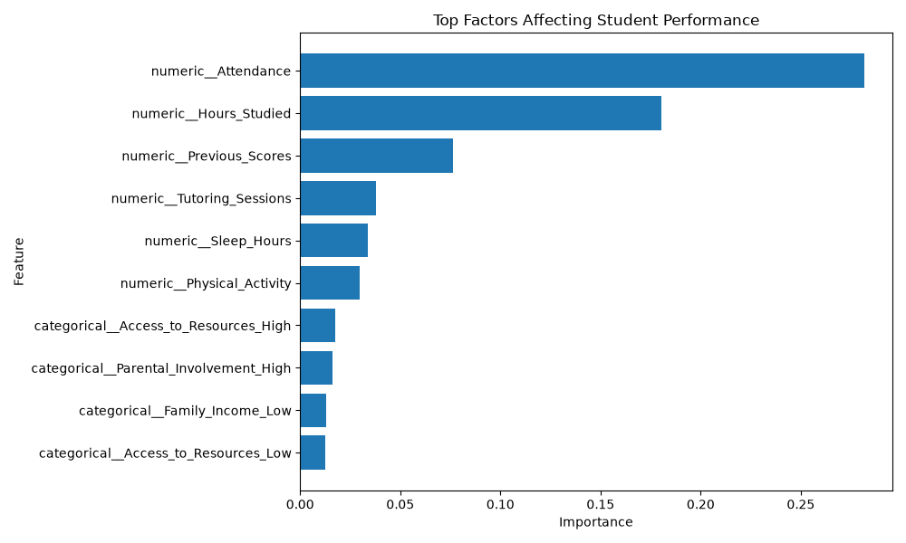
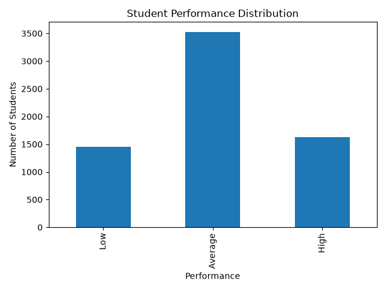
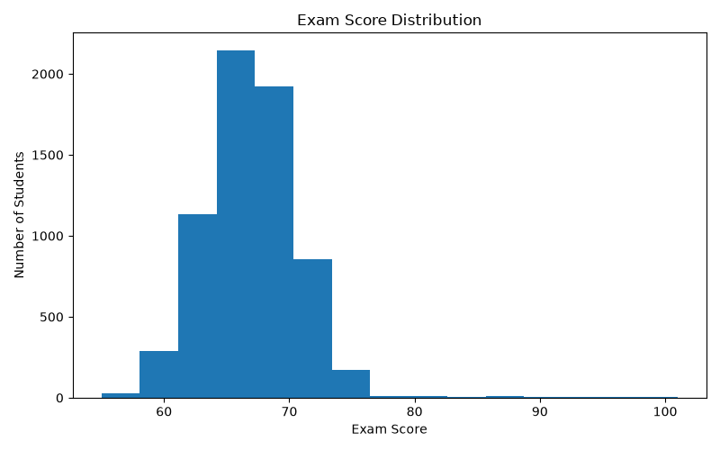

# Student Performance Classifier

A machine learning based application that predicts student performance as **High, Average, or Low** using academic, personal, and learning-related factors.

The project also provides confidence scores, identifies at-risk students, gives improvement suggestions, supports CSV-based batch prediction, and provides model evaluation visualizations.

## Live Demo

[Open Student Performance Classifier](https://student-performance-classifier-omikakumar.streamlit.app/)

## Features

- Predicts student performance as **High, Average, or Low**
- Displays prediction **confidence score**
- Flags students who may be **at risk**
- Provides **improvement suggestions** based on weaker factors
- Supports prediction for multiple students through **CSV upload**
- Shows **confusion matrix** for model evaluation
- Shows important factors using **feature importance**
- Includes basic **exploratory data analysis (EDA)**
- Simple interactive interface using Streamlit

## Tech Stack

- Python
- Pandas
- NumPy
- Scikit-learn
- Matplotlib
- Streamlit
- Joblib

## Dataset

The project uses the **Student Performance Factors Dataset** containing 6,607 student records and 19 input factors.

### Input Factors

- Hours Studied
- Attendance
- Parental Involvement
- Access to Resources
- Extracurricular Activities
- Sleep Hours
- Previous Scores
- Motivation Level
- Internet Access
- Tutoring Sessions
- Family Income
- Teacher Quality
- School Type
- Peer Influence
- Physical Activity
- Learning Disabilities
- Parental Education Level
- Distance from Home
- Gender

The target variable is based on the student's **Exam Score**.

## Performance Classification

Students are classified using the following thresholds:

| Exam Score | Performance |
|---|---|
| 70 or above | High |
| 65–69 | Average |
| Below 65 | Low |

## Machine Learning Approach

### 1. Data Preprocessing

- Loaded the dataset using Pandas
- Handled missing values
- Converted categorical features using One-Hot Encoding
- Used numerical imputation for numerical features
- Used a Scikit-learn preprocessing pipeline

### 2. Model

A **Random Forest Classifier** was used for prediction.

The dataset was divided into:

- 80% Training data
- 20% Testing data

Stratified splitting was used to maintain the class distribution.

### 3. Model Performance

The model achieved an accuracy of approximately:

**84.04%**

Classification results:

| Class | Precision | Recall | F1-Score |
|---|---:|---:|---:|
| Average | 0.84 | 0.87 | 0.86 |
| High | 0.86 | 0.79 | 0.83 |
| Low | 0.82 | 0.81 | 0.82 |

## Model Evaluation

### Confusion Matrix

The confusion matrix shows how correctly the model classified students across the three performance categories.



### Feature Importance

Feature importance is used to identify which input factors contribute most to the Random Forest model's predictions.



## Exploratory Data Analysis

### Performance Distribution



### Exam Score Distribution



## At-Risk Student Detection

The application provides an at-risk indicator based on the predicted performance:

- **Low:** Student may require immediate academic support
- **Average:** Student may benefit from additional support
- **High:** Student is not flagged as at-risk

## Improvement Suggestions

The application checks weaker factors and provides simple suggestions such as:

- Increasing study time
- Improving attendance
- Strengthening weak academic topics
- Getting sufficient sleep
- Considering tutoring or academic support
- Increasing physical activity
- Improving motivation and study routine
- Seeking additional learning resources
- Building a supportive study environment

## CSV Batch Prediction

The application also allows users to upload a CSV file containing multiple student records.

For each student, the application provides:

- Predicted Performance
- Confidence Score
- At-Risk Status

The results can also be downloaded as a CSV file.

## Project Structure

```text
student-performance-classifier/
│
├── data/
│   ├── StudentPerformanceFactors.csv
│   └── student_processed.csv
│
├── models/
│   └── student_performance_model.pkl
│
├── src/
│   ├── dataset_check.py
│   ├── eda.py
│   ├── evaluate.py
│   ├── feature_importance.py
│   ├── preprocess_new.py
│   └── train_model.py
│
├── app.py
├── confusion_matrix.png
├── feature_importance.png
├── performance_distribution.png
├── exam_score_distribution.png
├── README.md
└── requirements.txt

Challenges and Solutions

Handling Missing Values

Some dataset features contained missing values. These were handled using appropriate imputation methods during preprocessing.

Categorical Features

Several student-related factors were categorical. One-Hot Encoding was used to convert them into numerical representations suitable for machine learning.

Multi-Class Classification

The original exam score was converted into three meaningful performance categories: High, Average, and Low.

Model Evaluation

The model was evaluated using accuracy, precision, recall, F1-score, and a confusion matrix.

Project Goal

The goal of this project is to demonstrate how machine learning can be used to analyze student-related factors and provide an understandable performance classification that can support early academic intervention.